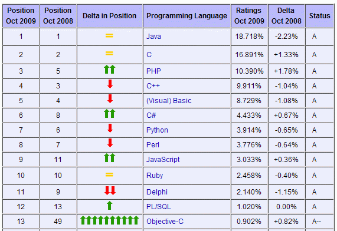

= GNUstep Getting Started
Orest Ivasiv
2009-11-08
:jbake-type: post
:jbake-status: published
:jbake-tags: GNUstep, Objective-C
:source-highlighter: prettify
:icons: font

Objective-C popularity aggressively increased based on
http://www.tiobe.com/index.php/content/paperinfo/tpci/index.html[TIOBE
Index] (for October 2009) 

The reason is simple -- iPhone and all related stuff. We should be ready to
develop Objective-C based application in future. The worst thing I don't
have a Mac, so I don't have development environment. I need to get basic
Objective-C knowledge, and here several solutions:

* buy Mac
* install http://en.wikipedia.org/wiki/OSx86[Hackintosh ]on PC
* try GNU compiler and play with Objective-C

The better choice is the last one (for me). As I'm a Windows XP user and
I don't have a time to set up Linux, I'm going to use some Windows GNU
GCC port: Cygwin or MinGW.

There are two cross-platform projects which implements Objective-C
Cocoa/OpenStep APIs:

* http://www.cocotron.org/[The Cocotron] -- this project uses Mac
machine for build (I didn't dig into this), but built application can be
run on Windows.
* http://www.gnustep.org/[GNUstep] -- this project supports many
platforms (Windows included).

My choice is 

Here is the useful links for quick start:

* http://www.gnustep.org/[www.gnustep.org] -- official site
* http://www.gnustep.it/nicola/Tutorials/index.html[GNUstep programming
mini tutorials] -- the second place you should start with.
* http://www.gnustep.it/[www.gnustep.it] -- This site is dedicated to
http://www.gnustep.org/[GNUstep]. There are a lot of useful info.
* http://gap.nongnu.org/[GNUstep Application Project] -- The purpose of
this project is to implement a set of administrative applications and
user level applications using GNUstep. Another aim of this project is to
port as many applications from OPENSTEP/Cocoa to GNUstep as possible.
Great place to look into real application.
* http://www.foldr.org/%7Emichaelw/objective-c/[Objective-C: Links,
Resources, Stuff] -- dig deeper in Objective-C culture
* http://gnustep.made-it.com/[GNUstep Library] -- additional info: Build
Guides, User Documentation, Developer Documentation
* http://old.nabble.com/GNUstep-f1880.html[GNUstep forum] -- it covers
the next categories: General, Help, Dev, Webmasters, Bugs, Announce,
Apps
* http://www.roard.com/docs/[GNUstep HelpCenter] -- links to various
tutorials and articles on GNUstep.
* http://wiki.gnustep.org/[GNUstepWiki] -- just _wiki_

=== How to build your first GNUstep application in Windows?
In general it's simple, but if you have some troubles with it here is the links:

1. http://www.techotopia.com/index.php/Installing_and_using_GNUstep_and_Objective-C_on_Windows#Downloading_the_GNUstep_Packages[Installing and using GNUstep and Objective-C on Windows]
2. http://www.gnustep.it/nicola/Tutorials/WritingMakefiles/[Writing GNUstep Makefiles] (I highly recommend it)
3. http://blog.lyxite.com/2008/01/compile-objective-c-programs-using-gcc.html[Compile Objective-C Programs Using gcc]